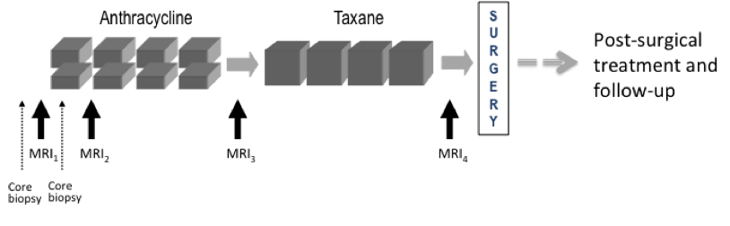

# Breast Cancer MRI Segmentation

Breast cancer is the second leading cause of death for women all over the world. Since the cause of the disease remains unknown, early diagnosis is the key for breast cancer control, and it can increase the success of treatment, save lives and reduce costs.

The work focus on Investigation of Serial Studies to Predict Your Therapeutic Response with Imaging and moLecular Analysis (I-SPY TRIAL) breast cancer trial, a study of imaging and tissue-based biomarkers for predicting pathologic complete response (pCR) and recurrence-free survival (RFS).

ISPY1 dataset includes 230 studies with T3 tumors measuring at least 3 cm in diameter by clinical exam or imaging.
MRI exams were performed within four weeks prior to starting anthracycline-cyclophosphamide chemotherapy (T1, MRI1), at least 2 weeks after the first cycle of AC and prior to the second cycle of AC (T2, MRI2), between anthracycline-cyclophosphamide treatment and taxane therapy if taxane was administered (T3, MRI3), and after the final chemotherapy treatment and prior to surgery (T4, MRI4). The study schema is shown below.

The main porpuse of the works is to create ML tool that could take women breast scan and segment the tumor area with highly precision. For developing such tool first scans (T1, MRI) were taken as database and U-net model choose and trained with verious structure and loss functions.

### Database:
Each series contain diffferent scans, for that specific work the scans that were used is:
* Full scan
* Scan with PE
* Scan with SER
* Breast Tissue Segmentation 

Full scan - contatin full breast scan without segmentation layer.
PE scan - contain tumor responds to neoadjuvant treatment, i.e tumor segmentation
SER scan - contain tumor responds to neoadjuvant treatment, i.e tumor segmentation
Breast tissue segmentation contatin 3D cordinate of the segmantation box.

Note: PE and SER are different contast enhancement technique.

For more information:
<a href="https://wiki.cancerimagingarchive.net/display/Public/I+SPY-1+DCE+MRI+Data+Sharing+DICOM+Dictionary" target="_blank">`https://wiki.cancerimagingarchive.net/display/Public/I+SPY-1+DCE+MRI+Data+Sharing+DICOM+Dictionary`</a>

### Data Pre-Processing:
Since the segmentation layers are full scan with tumor responds to neoadjuvant treatment there are some scans w\o actual responds to reatment, i.e w\o segmentation. In additional, since the responds is non-uniform along the tumor, the scan has noise and holes that the pre-processing phase should deal with. 
The preprocessing tool include scans dynamic range exclusion and morphological operations. The dynamic range is Max. & Min. for the entire series. The morphological operation that used to eliminate noise and get resonable segmentation is OPEN with binary threshold of about 10%. All that is for reducing image noise and close segmentation areas - we assume the tumor have continuity. After the preprocess the segmentation layer were ready for training model.

### Model training:
First the enitre data gather into pairs of scans and segmantation layer and then feed into U-net model with XXXX atructure.
The best parameters were: XXXXX

### Results:

### Conclusions:

## Code Structure

### Main Function:

**U-Net network**

    # U-net network implement as integrated part of overall algorithm with some modification for raw-data properties
    # Refernce for U-Net can be seen at: https://github.com/zhixuhao/unet.git
    
**Loss funtions**
    
    # Several loss functions where used for segmentation tasks. 
      The final lost that used was weighted combination of DICE loss and BCE.

**MRIDataCollection.py**
    
    # This function extract DICOM files and create scan and segmentation pairs in dedicate folders
    
**Main_Model.py**
    
    # The main engine for that work.
    # This function is the main function for training the model and get results.
   
   
## How to use
   
### Dependencies
This code depends on the following libraries:
* Scikit-Image 0.16.1
* OpenCV
* PyTorch
* TensorboardX
* PyDicom 

### PreRequsite
Prior to running the model, the raw files (First scan of each patient) should be download to folder {WorkingDirectory}\ISPY1
After download finished - runing function MRIDataCollection.py
* Parameters:
    * `--data-path` - Where the raw data is located
    * `--mask-path` - Where to save the segmenations after the PreProcessing phase
    * `--image-path` - Where to save the scans that correllate to segmenations slices.
    
**Example:**

    python MRIDataCollection.py --data-path DataBase\ISPY1 --image-path Data\ISPY1\Image --mask-path Data\ISPY1\Mask
    
### Define and Model execution
* The Model is parser based execution. All needed parameters for optimization are exposed as parser.
* Parameters:
    * `--num-chnas` - Define the first U-Net layer span of layers.
    * `--data-path` - Define the folder where Image and Mask folders located
    * `--batch-size` - Define batch size
    * `--lr` - Define Learning rate
    * `--exp-dir` - Define where to save Model results to be able to visualize that with TensorBoard.

**Example:**

    python Main_Model.py --challenge singlecoil --num-chans 16 --drop-prob 0.5 --data-path Data\ISPY1 --num-pools 5 --num-epoch 20 --batch-size 1 --exp-dir checkpoints
    
### Test the resuls
* The results saved as Tensorboard files at `--exp-dir`
* Luanching Tensorboard to see the results
* Open browser and type the {HostIP}:{PORT}, Tensorboard should open and display the results

**Example:**
    
    tensorboard --logdir checkpoint --host {HostIP} --port {Port}
<!--    
1. Download the scans from: https://www.cancerimagingarchive.net/nbia-search/?CollectionCriteria=ISPY1. The scans are order chronoligicaly, needs to download only the erlier scan for each patient (Total 200 patients).Need to download specific files from each series, the files are:
* Full scan
* Scan with PE
* Scan with SER
* Breast Tissue Segmentation 
2. Place the file at: {Working Directory}\DataBase
3. For Pre-Processing run MRIDataCollection.py
    python MRIDataCollection.py --data-path 
4. For running training phase run Main_Model.py
    python Main_Model.py --
-->
    
## Refrences:
ISPY1 - 
* https://wiki.cancerimagingarchive.net/display/Public/ISPY1
* https://wiki.cancerimagingarchive.net/display/Public/I+SPY-1+DCE+MRI+Data+Sharing+DICOM+Dictionary
