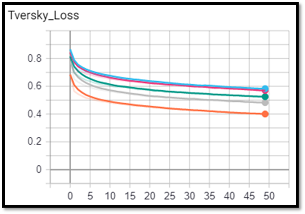
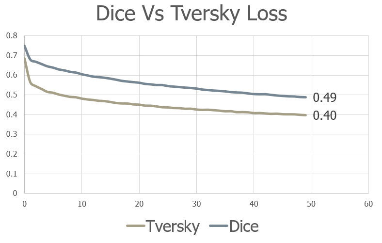

# Breast Cancer MRI Segmentation

Breast cancer is the second leading cause of death for women all over the world. Since the cause of the disease remains unknown, early diagnosis is the key for breast cancer control, and it can increase the success of treatment, save lives and reduce costs.

The work focus on Investigation of Serial Studies to Predict Your Therapeutic Response with Imaging and moLecular Analysis (I-SPY TRIAL) breast cancer trial, a study of imaging and tissue-based biomarkers for predicting pathologic complete response (pCR) and recurrence-free survival (RFS).

ISPY1 dataset includes 230 studies with T3 tumors measuring at least 3 cm in diameter by clinical exam or imaging.
MRI exams were performed within four weeks prior to starting anthracycline-cyclophosphamide chemotherapy (T1, MRI1), at least 2 weeks after the first cycle of AC and prior to the second cycle of AC (T2, MRI2), between anthracycline-cyclophosphamide treatment and taxane therapy if taxane was administered (T3, MRI3), and after the final chemotherapy treatment and prior to surgery (T4, MRI4). The study schema is shown below.

The main purpose of the works is to create ML tool that could take women breast scan and segment the tumor area with highly precision. For developing such tool first scans (T1, MRI) were taken as database and U-net model choose and trained with various structure and loss functions.

### Database:
Each series contain different scans, for that specific work the scans that were used is:
* Full scan
* Scan with PE
* Scan with SER
* Breast Tissue Segmentation 

Full scan - contain full breast scan without segmentation layer.
PE scan - contain tumor responds to neoadjuvant treatment, i.e. tumor segmentation
SER scan - contain tumor responds to neoadjuvant treatment, i.e. tumor segmentation
Breast tissue segmentation contain 3D coordinate of the segmentation box.

Note: PE and SER are different contrast enhancement technique.

For more information:
<a href="https://wiki.cancerimagingarchive.net/display/Public/I+SPY-1+DCE+MRI+Data+Sharing+DICOM+Dictionary" target="_blank">`https://wiki.cancerimagingarchive.net/display/Public/I+SPY-1+DCE+MRI+Data+Sharing+DICOM+Dictionary`</a>

### Data Pre-Processing:
Since the segmentation layers are full scan with tumor responds to neoadjuvant treatment there are some scans w\o actual responds to treatment, i.e. w\o segmentation. In additional, since the responds is non-uniform along the tumor, the scan has noise and holes that the pre-processing phase should deal with. 
The preprocessing tool include scans dynamic range exclusion and morphological operations. The dynamic range is Max. & Min. for the entire series. The morphological operation that used to eliminate noise and get reasonable segmentation is OPEN with binary threshold of about 10%. All that is for reducing image noise and close segmentation areas - we assume the tumor have continuity. After the preprocess the segmentation layer were ready for training model. Pre-Processing show below:

### Model training:
First the entire data gather into pairs of scans and segmentation layer and then feed into U-net model.
The model ran with a lot of architectures configurations like below:

    # --lr 0.001 --epochs 100 --droupout 0.5 --num-chans 32 --pools 5

### Results:

First U-net model ran with different architectures to find the best model architecture for the specific database.
Configuration of `--lr 0.001 --epochs 1000 --droupout 0.5 --num-chans 64 --pools 5` achieve the best results with WBCE coefficient of 0.5 plus Dice loss

After finding the best architecture the model tests with several WBCE loss coefficient. As expected, no improvement within the loss function since WBCE coefficient is just multiplication coefficient that shouldn’t impact gradient steps optimization.

The second tested loss function was Tversky Loss. Several optimization done with different Tversky coefficient combinations.
The results below shown that `Tversky Loss with Alpha = 0.1, Beta = 0.9` provide the best results. The results meaning that the loss penalizing more sensitive for False-Negative error. 

Finally Dice loss and Tversky loss compare to find which loss is the best loss for the proposed model architecture, Tversky loss was the best one.

Summary:
* U-Net best configuration is: `--lr 0.001 --epochs 1000 --droupout 0.5 --num-chans 64 --pools 5 --loss Tversky --tversky-alpha 0.1 –tversky-beta 0.9`
* No significant improvement after 1000 epochs. 
* Both Tversky and Dice loss combination ran with 50 epochs to understanding loss trends and save computational time
* Scan with closed filled contours provide better result than open contours
* Dice \ Tversky values are reasonable for first order training model
* Tversky loss is more efficient for medical segmentation especially when the database is limited.

### Conclusions:

* Image pre-processing for scans & segmentation has critical effect for DL model results 
* Medical imaging segmentation is not an easy task
* By using combination of different loss function with the right weighting, the final results could improve significantly
* Sometimes heavy model with large computational time is not always the right way to get the best results. Loss function could converge the model faster and be more sophisticated.
* Future work - 
    * Drill down with intensive pre-processing tools for masks creation and combination of complex loss functions
    * Try to implement Un-Supervised model with Momford-Shah Loss

## Code Structure

### Main Function:

**U-Net network**

    # U-net network implement as integrated part of overall algorithm
      with some modification for raw-data properties
    # Reference for U-Net can be seen at: https://github.com/zhixuhao/unet.git
    
**Loss functions**
    
    # The work focused on the effect of choosing the right loss function 
      with respect to high convergence and light-weight model
    # Several loss functions where used for segmentation tasks. 
    # The best loss function choose as loss that converge faster and provide highly segmentation results

**MRIDataCollection.py**
    
    # This function extract DICOM files and create scan and segmentation pairs in dedicate folders
    
**Main_Model.py**
    
    # The main engine for that work.
    # This function is the main function for training the model and get results.
   
   
## How to use
   
### Dependencies
This code depends on the following libraries:
* Scikit-Image 0.16.1
* OpenCV
* PyTorch
* TensorboardX
* PyDicom 

### Prerequisite
Prior to running the model, the raw files (First scan of each patient) should be download to folder {WorkingDirectory}\ISPY1
After download finished - running function MRIDataCollection.py
* Parameters:
    * `--data-path` - Where the raw data is located
    * `--mask-path` - Where to save the segmentations after the PreProcessing phase
    * `--image-path` - Where to save the scans that correlate to segmentations slices.
    
**Example:**

    python MRIDataCollection.py --data-path DataBase\ISPY1 --image-path Data\ISPY1\Image --mask-path Data\ISPY1\Mask
    
### Define and Model execution
* The Model is parser based execution. All needed parameters for optimization are exposed as parser.
* Parameters:
    * `--num-chnas` - Define the first U-Net layer span of layers.
    * `--data-path` - Define the folder where Image and Mask folders located
    * `--batch-size` - Define batch size
    * `--lr` - Define Learning rate
    * `--loss` - Define which Loss function to use - Tversky ot WBCE_DiceLoss
        * `--WBCE-diceloss` - Define the coefficient of Dice loss at overall loss function
        * `--tversky-alpha` - Define Tversky Alpha coefficient
        * `--tversky-beta` - Define Tversky Beta coefficient
    * `--exp-dir` - Define where to save Model results to be able to visualize that with TensorBoard.

**Example:**

    python Main_Model.py --challenge singlecoil --num-chans 16 --drop-prob 0.5 --data-path Data\ISPY1 --num-pools 5 --num-epoch 20 --batch-size 1 --exp-dir checkpoints
    
### Test the results
* The results saved as Tensorboard files at `--exp-dir`
* Launching Tensorboard to see the results
* Open browser and type the {HostIP}:{PORT}, Tensorboard should open and display the results

**Example:**
    
    tensorboard --logdir checkpoint --host {HostIP} --port {Port}
<!--    
1. Download the scans from: https://www.cancerimagingarchive.net/nbia-search/?CollectionCriteria=ISPY1. The scans are order chronologically, needs to download only the earlier  scan for each patient (Total 200 patients).Need to download specific files from each series, the files are:
* Full scan
* Scan with PE
* Scan with SER
* Breast Tissue Segmentation 
2. Place the file at: {Working Directory}\DataBase
3. For Pre-Processing run MRIDataCollection.py
    python MRIDataCollection.py --data-path 
4. For running training phase run Main_Model.py
    python Main_Model.py --
-->
    
## References:
ISPY1 - 
* https://wiki.cancerimagingarchive.net/display/Public/ISPY1
* https://wiki.cancerimagingarchive.net/display/Public/I+SPY-1+DCE+MRI+Data+Sharing+DICOM+Dictionary

Losses - 
* https://github.com/Hsuxu/Loss_ToolBox-PyTorch
